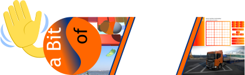
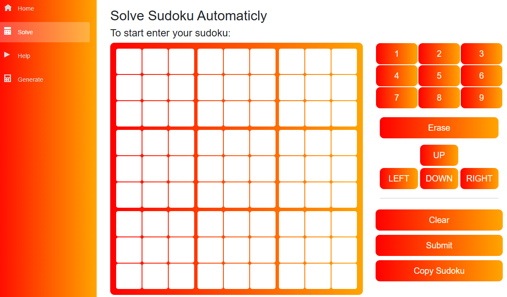
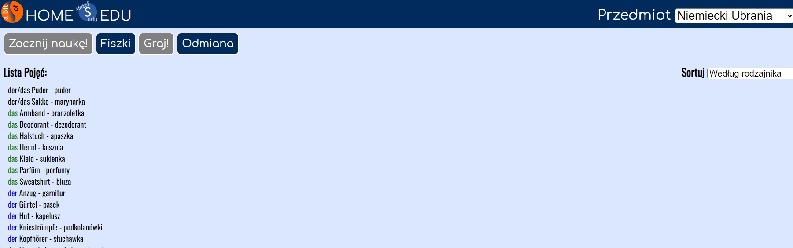
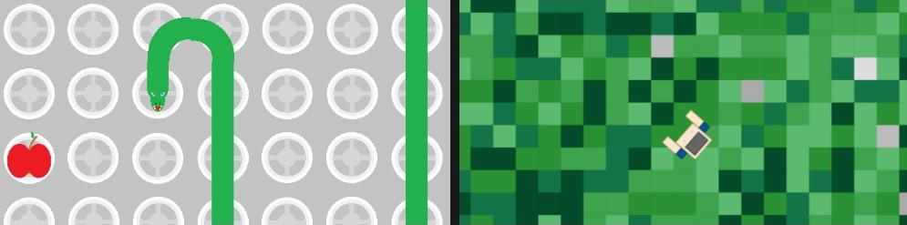

# Hello

Visit <a href="https://abitofs.github.io/en.html">my home page</a> also <a href="https://abitofs.github.io/">in polish</a> to tryout my project

## Or scroll down to view their description and source code here

 

## [Sudoku](https://abitofs.github.io/sudokuSolve)

My first complete app with lots of functions:
- Sudoku solving
- Comfortable environment for solving on your own
- Generating tables
In the future I consider adding:
- Different sizes/types of tables - now only standard 9x9
- Better look on mobile devices - this version don't have compatibility with them
- Ability to generate more tables at one time

 

## [EDU](https://abitofs.github.io/edu)

[view source code](https://github.com/aBitOfS/edu)

Constntly under development educational webpage, which aim to cover issues of other similar websites:
- Price - free
- More ways of learning, e.g.:
	- Classic flash cards
	- Writing using best ideas from other webpages
	- Mixed
	- Map quiz
- More information in one quiz - not only term - definition pairs, but unlimited fields with custom names
- Fully customisable

## [Games](https://abitofs.github.io/webGames)

[view source code](https://github.com/aBitOfS/webGames)

Consist of two projects:

### Snake

Standard snake game

### LockedIn3

Not finished yet

 

### [Cameras](https://abitofs.github.io/kamery/kameryn.html)
[view source code](kamery/)

Site which help you to manage screen for viewing multiple videos/sites at once

 

### The rest of projects:

### [Disco](https://abitofs.github.io/Disco.html)
[view source code](Disco.html)

Dynamicly changing colors on the phone's/computer's screen